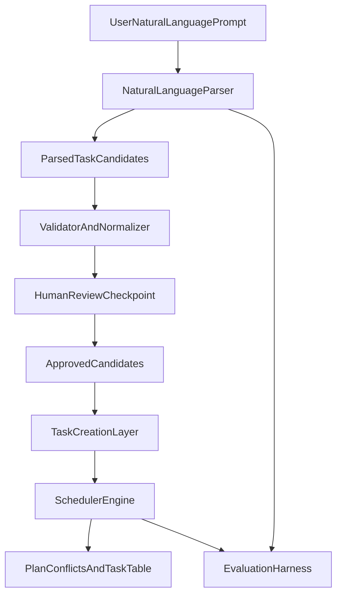

# PawPal NL Task Creation Architecture

```mermaid
flowchart TD
    userInput[UserNaturalLanguagePrompt] --> parser[NaturalLanguageParser]
    parser --> candidates[ParsedTaskCandidates]
    candidates --> validator[ValidatorAndNormalizer]
    validator --> review[HumanReviewCheckpoint]
    review --> approved[ApprovedCandidates]
    approved --> creator[TaskCreationLayer]
    creator --> scheduler[SchedulerEngine]
    scheduler --> appOutput[PlanConflictsAndTaskTable]
    parser --> evalHarness[EvaluationHarness]
    scheduler --> evalHarness
```

Human-in-the-loop review occurs before parsed candidates become persistent tasks.
